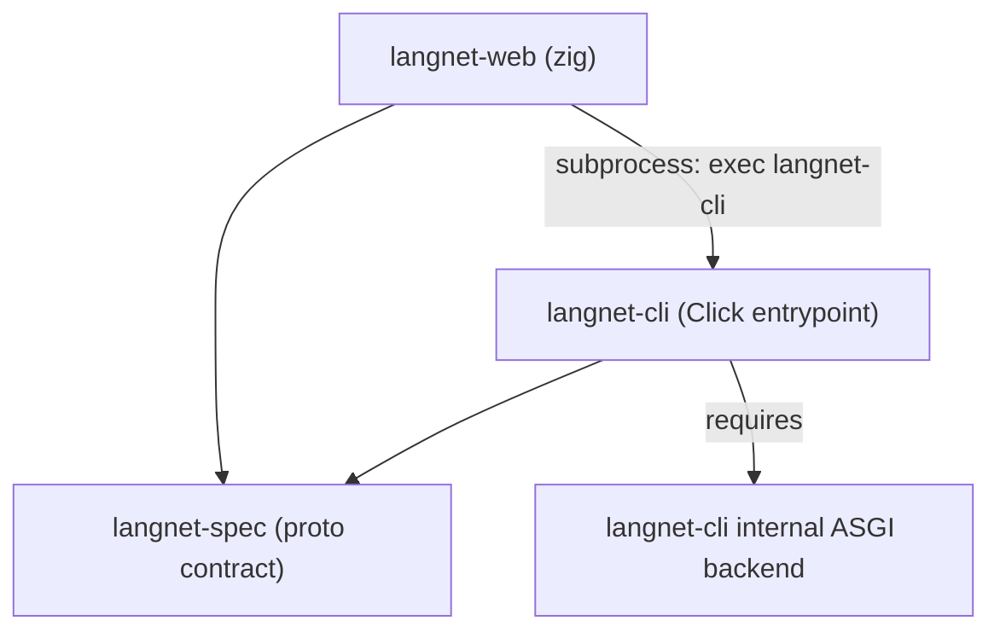
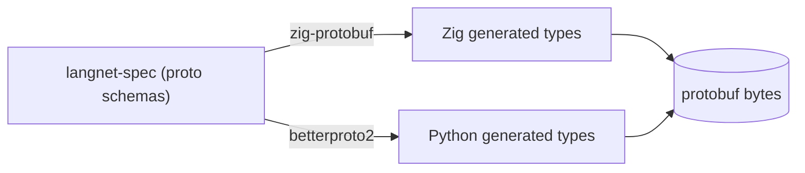

# Contract and Boundaries

## Contract: `langnet-spec`

`langnet-spec` defines the protobuf schemas used across components.
- Zig types: generated via `zig-protobuf`
- Python types: generated via `betterproto2`

## Boundary: web integrates via CLI subprocess

`langnet-web` integrates by spawning `langnet-cli` as a subprocess.  
The internal ASGI server is a required dependency of the CLI, not a public integration target.

schema generation

