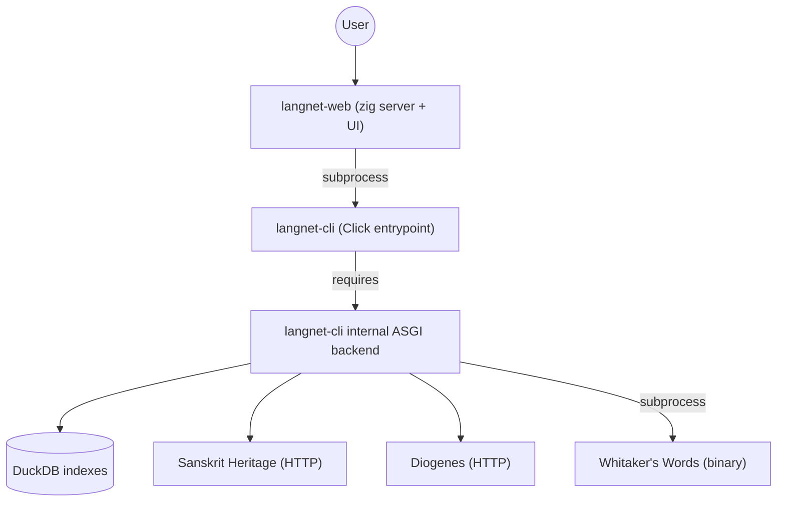
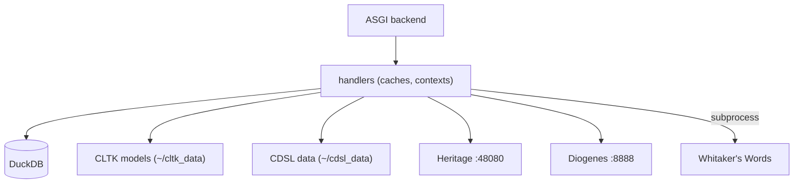

# Runtime and Dependencies

## Runtime topology (current)

- `langnet-web` runs as a Zig HTTP server + browser UI.
- `langnet-web` spawns `langnet-cli` as a subprocess for queries.
- `langnet-cli` depends on an internal ASGI server for stateful logic (caches, contexts).
- The ASGI backend calls external engines and persists/query indexes in DuckDB.

  
## External service requirements (must already exist)

From langnet-cli README expectations:
Sanskrit Heritage Platform: localhost:48080
Diogenes: localhost:8888
Whitaker's Words binary: ~/.local/bin/whitakers-words
Automatic downloads on first use:
CLTK models to ~/cltk_data/
CDSL data to ~/cdsl_data/
Dependency internals (implementation detail)External service requirements (must already exist)
From langnet-cli README expectations:
Sanskrit Heritage Platform: localhost:48080
Diogenes: localhost:8888
Whitaker's Words binary: ~/.local/bin/whitakers-words
Automatic downloads on first use:
CLTK models to ~/cltk_data/
CDSL data to ~/cdsl_data/

## Dependency internals (implementation detail)

