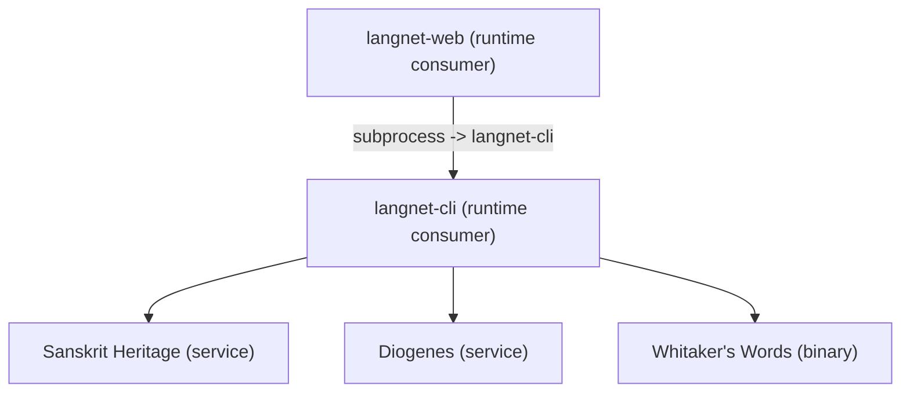
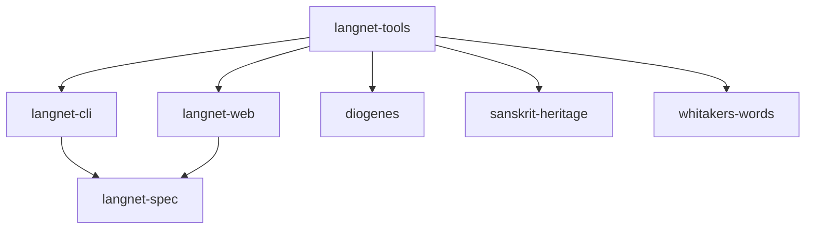

# Repos and Builds

This is a “what lives where” index.

## Primary repos

- `langnet-spec`
  - protobuf schemas (contract)
  - codegen: Python (betterproto2), Zig (zig-protobuf)

- `langnet-cli`
  - Click CLI entrypoint
  - ASGI backend (uvicorn) for stateful logic
  - stores/indexes data in DuckDB
  - calls external engines (Heritage, Diogenes, Whitaker’s)

- `langnet-web`
  - Zig HTTP server + HTML frontend
  - uses protobuf contract types
  - integrates by spawning `langnet-cli` subprocess

- `langnet-tools`
  - harness / process compose
  - helps bring up required external services and binaries

## External / self-hosted deps (selected)

- Sanskrit Heritage ecosystem:
  - `Zen` (OCaml lib)
  - `Heritage_Resources` (data)
  - `Heritage_Platform` (OCaml CGI)
  - `sanskrit-heritage` (httpd harness)

- `diogenes` (Perl server; full functionality requires Packard Humanities CD-ROM data)
- `whitakers-words` (Ada binary)

- Zig libs used by `langnet-web`:
  - `zzz-nossl`
  - `mustache-zig`

## Repo dependency graph

