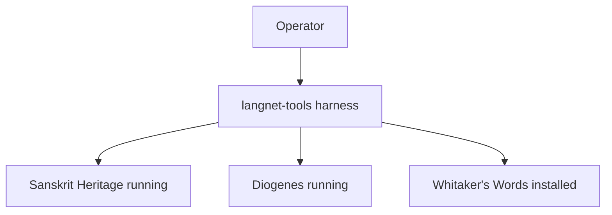
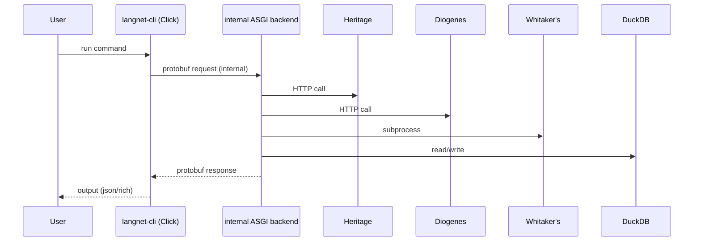
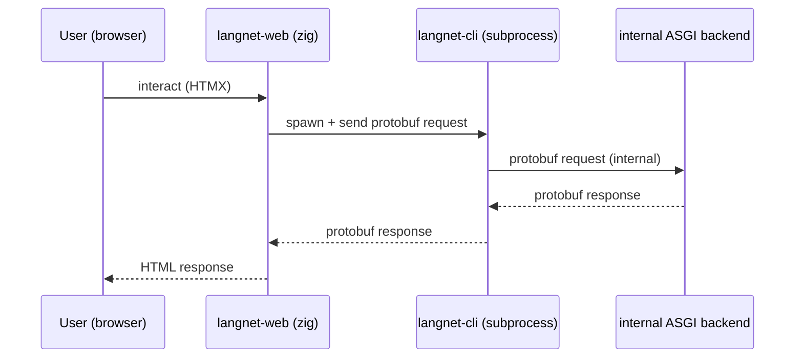

# Key Flows

## 1) Backend dependency setup (operator flow)

Goal: make required services/binaries available before queries work.

```mermaid
flowchart TB
  op["Operator"]
  tools["langnet-tools harness"]
  heritage["Sanskrit Heritage running"]
  diogenes["Diogenes running"]
  whit["Whitaker's Words installed"]

  op --> tools
  tools --> heritage
  tools --> diogenes
  tools --> whit
```

## 2) cli query flow

```mermaid
sequenceDiagram
  participant U as User
  participant C as langnet-cli (Click)
  participant S as internal ASGI backend
  participant H as Heritage
  participant D as Diogenes
  participant W as Whitaker's
  participant DB as DuckDB

  U->>C: run command
  C->>S: protobuf request (internal)
  S->>H: HTTP call
  S->>D: HTTP call
  S->>W: subprocess
  S->>DB: read/write
  S-->>C: protobuf response
  C-->>U: output (json/rich)
```

## 3) web request flows

```mermaid
sequenceDiagram
  participant U as User (browser)
  participant W as langnet-web (zig)
  participant C as langnet-cli (subprocess)
  participant S as internal ASGI backend

  U->>W: interact (HTMX)
  W->>C: spawn + send protobuf request
  C->>S: protobuf request (internal)
  S-->>C: protobuf response
  C-->>W: protobuf response
  W-->>U: HTML response
```
